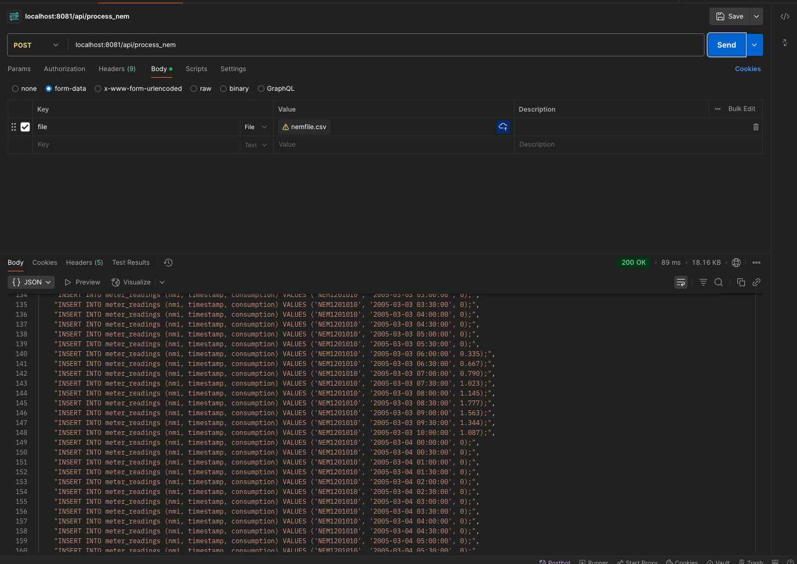

# NEM12 Parser

This is a Java Spring Boot microservice designed to process `NEM12` files, which are used to transmit electricity meter data in the energy market. 

This service parses `NEM12` files and generates SQL insert statements for meter readings.

## Technologies Used
- **Java**: Programming language
- **Spring Boot**: Framework for building the service
- **JUnit 5, Mockito**: For unit testing

# Getting Started
Follow these steps to get the service up and running:

1. Clone the repository.
2. Open a terminal and navigate to the project directory.
3. Run the following command to start the service:

### Running on Mac
Run the following scripts in the root directory of the project
```bash
./gradlew bootRun
```

### Running on Windows
Run the following scripts in the root directory of the project
```bash
gradlew.bat bootRun
```


# API Documentation
**Endpoint**: `POST` `localhost:8081/api/process_nem`

Accepts a `NEM12` file via form-data and returns a `JSON` list of SQL INSERT statements corresponding to the meter readings.

**Request**
```
Content-Type: multipart/form-data
Form Parameter: file - The NEM12 file
Success Response (200 OK):
Content-Type: application/json
Body: A JSON array of strings, where each string is a SQL INSERT statement.
```
**Example**



# NEM12 Format
`NEM12` is a file format that is used to transmit metering data from electricity meters.
Energy companies use `NEM12` files to perform settlements in the energy market and to bill customers correctly.

Each row of the `NEM12` file begins with a record type identifier:
- 100: File header
- 200: National Metering Identifier (NMI) info along with interval information
- 300: Metering information. Each new csv value for 300 rows represents a new meter reading at the rate of the interval in the preceding 200 row
- 400: Reading quality flags
- 900: File footer

For the purpose of this project, the service only reads 200 and 300 rows to identify the NIM and all the associated readings with that NMI

# Design considerations

## Dependency Injection
The service is structured using dependency injection, making it easy to swap out functionality. For example if we want to write the SQL queries directly to a SQL DB,
we can swap out or modify the SqlStatementGenerator class without breaking existing tests or functionality for the rest of the application.

## Large file handling
To handle large NEM12 files:

- The file is first saved to a temporary directory on disk.
- The file is read line by line using a BufferedReader to prevent out of memory errors when parsing huge files.
- A Multipart file upload mechanism is used, ensuring that large files are automatically written to disk without consuming too much memory.

## Output format choice
The service currently outputs a `JSON` list of Strings to allow this to be used as part of an existing production 
service where other microservices may call this service to generate the SQL insert statements.

Additionally this was selected to give the service more flexibility as the SQL generation logic is decoupled from any
actual DB integration. 

# Testing

## Run unit tests
`./gradlew test`


## Unit tests
The project has 90% code coverage:


## Integration tests
The integration tests uses Springboot's MockMVC class to test the full integration of all components of the application starting at the POST call. 

The response from the endpoint is validated against test data in `test/resources`

# Error Handling

When processing `NEM12` files, the service might encounter errors like:

- Empty Lines: Blank lines within the NEM12 file are ignored.
- 300 Record Before 200: If a 300 data record appears before its corresponding 200 NMI record, an error is logged, and that specific 300 record is skipped. The parser continues processing subsequent lines.
- Invalid/Empty Consumption Values: Within a 300 record, if individual interval readings are empty or contain non-numeric characters, those specific readings are skipped.

# Further Improvements

## Multithreading
For processes files even faster, we can use multiple threads to read batches of 300 lines at once. However this might be complex 
since we have to synchronise all threads to the NMI number for the first 200 row

## Direct Database Integration
Add ability to directly integrate with SQL DBs 

## Input Validation
More robust validation of NEM12 format rules beyond just checking record types of 200/300.

## Configuration
Add ability for external configuration to change behaviour of application when the 2 above features have been added


### Reference Documentation
For further reference, please consider the following sections:
* [Official NEM12 File Format Guide](https://aemo.com.au/-/media/files/electricity/nem/retail_and_metering/metering-procedures/2017/mdff_specification_nem12_nem13_final_v102.pdf)
